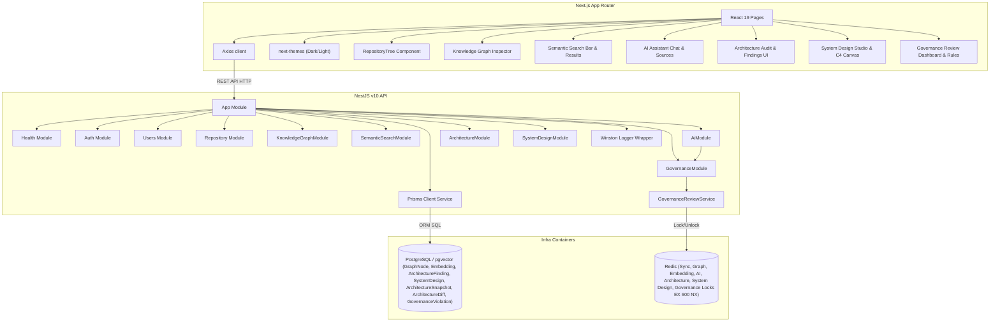

# ArchitectAI

ArchitectAI is an AI-powered Engineering Intelligence & System Design Platform. It digests git repositories, database schemas, and service interaction flows to construct comprehensive architecture insights, system design diagrams, and automated design audits.

---

## Vision

ArchitectAI aims to bridge the gap between abstract software architecture and actual repository implementations. By modeling the codebase as a system design knowledge graph, semantic vector index, grounded AI assistant, C4 diagram studio, and governance review engine, it provides engineers with:

1. **Automated Discovery**: Up-to-date visualization of system topologies, components, and service networks.
2. **Semantic Search & Intelligence**: Vector similarity search over codebases with contextual snippet chunking and ownership security.
3. **Grounded AI Repository Assistant**: Natural-language repository Q&A powered by RAG context combining vector search, knowledge graph relationships, architecture findings, C4 diagrams, and governance review diffs.
4. **Automated Architecture Auditing**: Deterministic cycle detection, coupling metrics, boundary violation checks, pattern detection, and structural risk scoring.
5. **Interactive System Design Studio**: Automated generation of C4 System Context, Container, and Component diagrams with interactive canvas editing and SVG/JSON export.
6. **Architecture Review & Governance Workflows**: Automated snapshot comparisons over releases, component & dependency diffs, risk score deltas, governance policy enforcement, and review status evaluation (`PASS`, `PASS_WITH_WARNINGS`, `FAILED`).

---

## Current Status

**Active Version**: `v0.1.8-architecture-governance`  
The project has completed **Phases 1 through 10**. The system features a production-ready authentication foundation, platform infrastructure, GitHub OAuth integration, Redis concurrency locking, full repository metadata and file tree ingestion, PostgreSQL knowledge graph persistence, a complete **Semantic Search Foundation**, an **AI Repository Understanding / RAG Foundation**, an **Architecture Discovery & Auditing Layer**, an **Interactive System Design Studio**, and **Architecture Review & Governance Workflows**:

- **Authentication Foundation**: OWASP-aligned `argon2id` passwords, short-lived (15-min) in-memory JWTs, 7-day rotated `HttpOnly` refresh cookies, and session-level database auditing.
- **Central Redis Cache & Coordination**: Global Redis connections via `ioredis` with exponential backoff retries, clean shutdowns, sync locks (`repository:sync-lock:<id>`), graph construction locks (`repository:graph-lock:<id>`), semantic indexing locks (`repository:embedding-lock:<id>`), AI request locks (`repository:ai-lock:<id>:<user>`), architecture analysis locks (`repository:architecture-lock:<id>`), system design locks (`system-design:generate-lock:<id>`), and governance review locks (`repository:governance-lock:<id>`).
- **Request Correlation**: Correlation IDs (`X-Request-ID`) mapped via `AsyncLocalStorage` and automatically printed in logs.
- **Structured Logging**: Logging interceptors capturing HTTP method, path, response codes, and durations.
- **Security Hardening**: Secure headers (Helmet) and strict comma-separated origins CORS checking.
- **Health Checks**: Liveness and readiness endpoints checking Prisma DB and Redis cache availability status.
- **GitHub Integration (Phase 3)**: GitHub OAuth service, repository module scaffolding, AES-256 encrypted token storage, and linked repository management.
- **Repository Intelligence Foundation (Phase 4)**: Normalized file tree ingestion (`RepositoryFile`), idempotent upserts, sync lifecycle tracking (`PENDING`/`RUNNING`/`SUCCESS`/`FAILED`), and REST endpoints for repository details, sync history, and tree navigation.
- **Knowledge Graph Foundation (Phase 5)**: PostgreSQL-backed graph models (`GraphNode` and `GraphEdge`), `NodeType` and `EdgeType` enums, deterministic hierarchy creation, lightweight import/dependency extraction, graph neighborhood traversal API, and interactive UI graph inspector.
- **Semantic Search Foundation (Phase 6)**: PostgreSQL pgvector storage, `Embedding` and `SemanticIndex` models, provider abstraction (`IEmbeddingProvider`), SHA-256 content hashing, idempotent indexing, file chunking, authenticated semantic search APIs, and frontend search interface.
- **AI Repository Understanding / RAG Foundation (Phase 7)**: Bounded RAG pipeline (`QueryUnderstandingService`, `ContextRetrieverService`, `ContextRankerService`, `ContextBuilderService`, `RagService`), LLM provider abstraction (`ILLMProvider`, default offline `MockLLMProviderService`), prompt injection isolation, grounded source citations, persistent `Conversation` / `ConversationMessage` tracking, and interactive AI chat UI tab.
- **Architecture Discovery & Auditing (Phase 8)**: `ArchitectureAnalysis` and `ArchitectureFinding` models, `ArchitectureDiscoveryService`, cycle detection (`CIRCULAR_DEPENDENCY`), coupling metrics (`HIGH_COUPLING`, `DEPENDENCY_HOTSPOT`), boundary violation checks (`BOUNDARY_VIOLATION`), pattern detection (`PATTERN_DETECTED`), deterministic risk scoring (0–100), RAG architecture context enrichment, and interactive Architecture Audit frontend tab.
- **System Design Studio & Interactive Diagramming (Phase 9)**: `SystemDesign`, `Diagram`, `DiagramNode`, and `DiagramEdge` models, C4 System Context, Container, and Component diagram generation (`DiagramGenerationService`), deterministic layout positioning (`DiagramLayoutService`), grounded RAG context injection (`SystemDesignContextService`), and interactive System Design Studio UI tab with SVG/JSON export.
- **Architecture Review & Governance Workflows (Phase 10)**: `ArchitectureSnapshot`, `ArchitectureSnapshotNode`, `ArchitectureSnapshotEdge`, `ArchitectureDiff`, `ArchitectureDiffItem`, `GovernanceRule`, and `GovernanceViolation` models, snapshot capturing (`ArchitectureSnapshotService`), diff engine (`ArchitectureDiffService`), rule evaluation (`GovernanceEngineService`), review status calculation (`GovernanceReviewService`), RAG governance context enrichment (`GovernanceContextService`), and interactive Governance dashboard frontend tab.
- **Dark / Light Theme**: Full site-wide theme toggling via `next-themes` with smooth animated transitions across all pages and components.

---

## Architecture Overview

ArchitectAI adopts a **Modular Monolith** pattern inside a monorepo workspace. High-level interactions are diagrammed below:

---

## Tech Stack

### Frontend

- **Next.js 15** (React 19, App Router)
- **TypeScript** (Strict compiler mode)
- **Tailwind CSS** (Utility styling, `darkMode: 'class'`)
- **next-themes** (Dark / Light mode with system preference support)
- **TanStack Query** (Client-side state & caching)
- **Axios** (API requests)
- **lucide-react** (Icon library)

### Backend

- **NestJS v10** (Module architecture, DI container)
- **Prisma ORM** (Type-safe schemas & migrations)
- **PostgreSQL / pgvector** (Core relational, graph, vector, architecture, system design, governance, and conversation database)
- **Winston** (Structured logging custom wrapper)
- **Zod** (Bootstrap environments validation)
- **Swagger** (Interactive API documentation)

---

## Architecture Decision Records (ADRs)

- [ADR-001: Architecture Foundation](docs/adr/ADR-001-architecture-foundation.md)
- [ADR-003: GitHub Integration](docs/adr/ADR-003-github-integration.md)
- [ADR-004: Repository Intelligence Foundation](docs/adr/ADR-004-repository-intelligence-foundation.md)
- [ADR-005: Knowledge Graph Foundation](docs/adr/ADR-005-knowledge-graph-foundation.md)
- [ADR-006: Semantic Search Foundation](docs/adr/ADR-006-semantic-search-foundation.md)
- [ADR-007: AI Repository Understanding / RAG Foundation](docs/adr/ADR-007-ai-rag-foundation.md)
- [ADR-008: Architecture Discovery & Auditing Foundation](docs/adr/ADR-008-architecture-discovery-auditing.md)
- [ADR-009: System Design Studio & Interactive Diagramming](docs/adr/ADR-009-system-design-studio.md)
- [ADR-010: Architecture Review & Governance Workflows](docs/adr/ADR-010-architecture-governance.md)

---

## Development Progress

- [x] **Phase 1** — Project Foundation
- [x] **Phase 2** — Authentication & Identity
- [x] **Phase 2.5** — Platform Infrastructure
- [x] **Phase 3** — GitHub Integration & Repository Management
- [x] **Phase 4** — Repository Intelligence Foundation
- [x] **Phase 5** — Knowledge Graph Foundation
- [x] **Phase 6** — Embedding & Semantic Search
- [x] **Phase 7** — AI Repository Chat / RAG Foundation
- [x] **Phase 8** — Architecture Discovery & Auditing
- [x] **Phase 9** — System Design Studio & Interactive Diagramming
- [x] **Phase 10** — Architecture Review & Governance Workflows
- [ ] **Phase 11** — Production Hardening & Multi-Tenant Deployment Readiness

---

## License

This project is licensed under the [MIT License](LICENSE).
