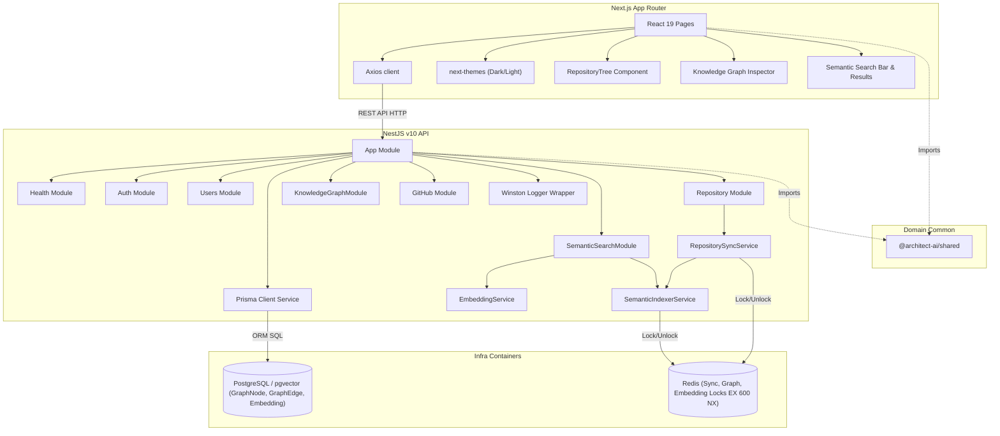

# ArchitectAI

ArchitectAI is an AI-powered Engineering Intelligence & System Design Platform. It digests git repositories, database schemas, and service interaction flows to construct comprehensive architecture insights, system design diagrams, and automated design audits.

---

## Vision

ArchitectAI aims to bridge the gap between abstract software architecture and actual repository implementations. By modeling the codebase as a system design knowledge graph and semantic vector index, it provides engineers with:

1. **Automated Discovery**: Up-to-date visualization of system topologies, components, and service networks.
2. **Semantic Search & Intelligence**: Vector similarity search over codebases with contextual snippet chunking and ownership security.
3. **Quality Auditing**: AI-powered analysis of design patterns, modular boundaries, and architectural drift.
4. **Studio Design**: Collaborative studio tools to mock and simulate changes before writing any code.

---

## Current Status

**Active Version**: `v0.1.4-semantic-search`  
The project has completed **Phases 1 through 6**. The system features a production-ready authentication foundation, platform infrastructure, GitHub OAuth integration, Redis concurrency locking, full repository metadata and file tree ingestion, PostgreSQL knowledge graph persistence, and a complete **Semantic Search Foundation**:

- **Authentication Foundation**: OWASP-aligned `argon2id` passwords, short-lived (15-min) in-memory JWTs, 7-day rotated `HttpOnly` refresh cookies, and session-level database auditing.
- **Central Redis Cache & Coordination**: Global Redis connections via `ioredis` with exponential backoff retries, clean shutdowns, sync locks (`repository:sync-lock:<id>`), graph construction locks (`repository:graph-lock:<id>`), and semantic indexing locks (`repository:embedding-lock:<id>`).
- **Request Correlation**: Correlation IDs (`X-Request-ID`) mapped via `AsyncLocalStorage` and automatically printed in logs.
- **Structured Logging**: Logging interceptors capturing HTTP method, path, response codes, and durations.
- **Security Hardening**: Secure headers (Helmet) and strict comma-separated origins CORS checking.
- **Health Checks**: Liveness and readiness endpoints checking Prisma DB and Redis cache availability status.
- **GitHub Integration (Phase 3)**: GitHub OAuth service, repository module scaffolding, AES-256 encrypted token storage, and linked repository management.
- **Repository Intelligence Foundation (Phase 4)**: Normalized file tree ingestion (`RepositoryFile`), idempotent upserts, sync lifecycle tracking (`PENDING`/`RUNNING`/`SUCCESS`/`FAILED`), and REST endpoints for repository details, sync history, and tree navigation.
- **Knowledge Graph Foundation (Phase 5)**: PostgreSQL-backed graph models (`GraphNode` and `GraphEdge`), `NodeType` and `EdgeType` enums, deterministic hierarchy creation, lightweight import/dependency extraction, graph neighborhood traversal API, and interactive UI graph inspector.
- **Semantic Search Foundation (Phase 6)**: PostgreSQL pgvector storage, `Embedding` and `SemanticIndex` models, provider abstraction (`IEmbeddingProvider`), SHA-256 content hashing, idempotent indexing, file chunking, authenticated semantic search APIs, and frontend search interface.
- **Dark / Light Theme**: Full site-wide theme toggling via `next-themes` with smooth animated transitions across all pages and components.

---

## Architecture Overview

ArchitectAI adopts a **Modular Monolith** pattern inside a monorepo workspace. The backend isolates concerns through domain modules while maintaining direct compiler references. High-level interactions are diagrammed below:

---

## Tech Stack

### Frontend

- **Next.js 15** (React 19, App Router)
- **TypeScript** (Strict compiler mode)
- **Tailwind CSS** (Utility styling, `darkMode: 'class'`)
- **next-themes** (Dark / Light mode with system preference support)
- **TanStack Query** (Client-side state & caching)
- **Axios** (API requests)
- **lucide-react** (Icon library)

### Backend

- **NestJS v10** (Module architecture, DI container)
- **Prisma ORM** (Type-safe schemas & migrations)
- **PostgreSQL / pgvector** (Core relational, graph, and vector database)
- **Winston** (Structured logging custom wrapper)
- **Zod** (Bootstrap environments validation)
- **Swagger** (Interactive API documentation)

### Shared Package

- **Shared Workspace Package** (`@architect-ai/shared`): Shares DTO types, schemas, constants, and utilities between packages.

---

## Configuration Variables

### Embedding Settings

| Variable                  | Default                  | Description                                              |
| :------------------------ | :----------------------- | :------------------------------------------------------- |
| `EMBEDDING_PROVIDER`      | `mock`                   | Embedding provider selection (`mock`, `local`, `openai`) |
| `EMBEDDING_MODEL`         | `text-embedding-3-small` | Active embedding model identifier                        |
| `EMBEDDING_DIMENSIONS`    | `1536`                   | Vector embedding dimensions size                         |
| `EMBEDDING_MAX_FILE_SIZE` | `524288`                 | Maximum file size in bytes to index (512 KB)             |
| `EMBEDDING_CHUNK_SIZE`    | `1000`                   | Target chunk character length                            |
| `EMBEDDING_CHUNK_OVERLAP` | `200`                    | Chunk overlap character count                            |

---

## API Documentation

The backend incorporates Swagger documentation automatically. Access interactive docs at:

- **Swagger UI**: [http://localhost:3001/api/docs](http://localhost:3001/api/docs)
- **REST Prefix**: `/api/v1`

---

## Architecture Decision Records (ADRs)

- [ADR-001: Architecture Foundation](docs/adr/ADR-001-architecture-foundation.md)
- [ADR-003: GitHub Integration](docs/adr/ADR-003-github-integration.md)
- [ADR-004: Repository Intelligence Foundation](docs/adr/ADR-004-repository-intelligence-foundation.md)
- [ADR-005: Knowledge Graph Foundation](docs/adr/ADR-005-knowledge-graph-foundation.md)
- [ADR-006: Semantic Search Foundation](docs/adr/ADR-006-semantic-search-foundation.md)

---

## Development Progress

- [x] **Phase 1** — Project Foundation
- [x] **Phase 2** — Authentication & Identity
- [x] **Phase 2.5** — Platform Infrastructure
- [x] **Phase 3** — GitHub Integration & Repository Management
- [x] **Phase 4** — Repository Intelligence Foundation
- [x] **Phase 5** — Knowledge Graph Foundation
- [x] **Phase 6** — Embedding & Semantic Search
- [ ] **Phase 7** — AI Repository Chat / RAG Foundation
- [ ] **Phase 8** — Architecture Discovery
- [ ] **Phase 9** — System Design Studio
- [ ] **Phase 10** — Architecture Review
- [ ] **Phase 11** — Production Hardening

---

## License

This project is licensed under the [MIT License](LICENSE).
