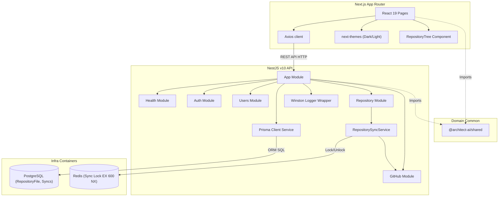

# ArchitectAI

[](#)
[](https://www.typescriptlang.org/)
[](https://nestjs.com/)
[](https://nextjs.org/)
[](https://www.postgresql.org/)
[](https://www.docker.com/)
[](LICENSE)

ArchitectAI is an AI-powered Engineering Intelligence & System Design Platform. It digests git repositories, database schemas, and service interaction flows to construct comprehensive architecture insights, system design diagrams, and automated design audits.

---

## Vision

ArchitectAI aims to bridge the gap between abstract software architecture and actual repository implementations. By modeling the codebase as a system design knowledge graph, it provides engineers with:

1. **Automated Discovery**: Up-to-date visualization of system topologies, components, and service networks.
2. **Quality Auditing**: AI-powered analysis of design patterns, modular boundaries, and architectural drift.
3. **Studio Design**: Collaborative studio tools to mock and simulate changes before writing any code.

---

## Current Status

**Active Version**: `v0.1.2-repository-intelligence`  
The project has completed **Phase 1**, **Phase 2**, **Phase 2.5**, **Phase 3**, and **Phase 4: Repository Intelligence Foundation**. The system features a production-ready authentication foundation, platform infrastructure, GitHub OAuth integration, Redis concurrency locking, full repository metadata and file tree ingestion, and interactive UI views:

- **Authentication Foundation**: OWASP-aligned `argon2id` passwords, short-lived (15-min) in-memory JWTs, 7-day rotated `HttpOnly` refresh cookies, and session-level database auditing.
- **Central Redis Cache & Locking**: Global Redis connections via `ioredis` with exponential backoff retries, clean shutdowns, and repository sync concurrency locks (`repository:sync-lock:<id>`).
- **Request Correlation**: Correlation IDs (`X-Request-ID`) mapped via `AsyncLocalStorage` and automatically printed in logs.
- **Structured Logging**: Logging interceptors capturing HTTP method, path, response codes, and durations.
- **Security Hardening**: Secure headers (Helmet) and strict comma-separated origins CORS checking.
- **Health Checks**: Liveness and readiness endpoints checking Prisma DB and Redis cache availability status.
- **GitHub Integration (Phase 3)**: GitHub OAuth service, repository module scaffolding, AES-256 encrypted token storage, and Prisma migration for linked repositories.
- **Repository Intelligence Foundation (Phase 4)**: Normalized file tree ingestion (`RepositoryFile`), idempotent upserts, sync lifecycle tracking (`PENDING`/`RUNNING`/`SUCCESS`/`FAILED`), and REST endpoints for repository details, sync history, and tree navigation.
- **Dark / Light Theme**: Full site-wide theme toggling via `next-themes` with smooth animated transitions across all pages and components.

---

## Architecture Overview

ArchitectAI adopts a **Modular Monolith** pattern inside a monorepo workspace. The backend isolates concerns through domain modules while maintaining direct compiler references. High-level interactions are diagrammed below:



---

## Tech Stack

### Frontend

- **Next.js 15** (React 19, App Router)
- **TypeScript** (Strict compiler mode)
- **Tailwind CSS** (Utility styling, `darkMode: 'class'`)
- **next-themes** (Dark / Light mode with system preference support)
- **TanStack Query** (Client-side state & caching)
- **Axios** (API requests)
- **lucide-react** (Icon library)

### Backend

- **NestJS v10** (Module architecture, DI container)
- **Prisma ORM** (Type-safe schemas & migrations)
- **PostgreSQL** (Core relational database)
- **Winston** (Structured logging custom wrapper)
- **Zod** (Bootstrap environments validation)
- **Swagger** (Interactive API documentation)

### Shared Package

- **Shared Workspace Package** (`@architect-ai/shared`): Shares DTO types, schemas, constants, and utilities between packages.

### Infrastructure & Tooling

- **Docker / Docker Compose**: Standard containers orchestration.
- **Husky / lint-staged**: Pre-commit verification.
- **Commitlint**: Conventional Git commits checking.
- **Makefile**: Developer CLI workflow shortcut directives.

---

## Monorepo Structure

```text
architect-ai/
│
├── frontend/               # Next.js client application
│   ├── src/
│   │   ├── app/            # App Router pages (/dashboard, /login, /repositories, /repositories/[id], /settings)
│   │   ├── components/     # Layout shells, repository components (Card, SyncButton, SyncStatus, Tree)
│   │   ├── providers/      # Query client & auth provider setup
│   │   └── services/       # Central Axios api client instance
│   └── tsconfig.json       # Extends root tsconfig.base.json
│
├── backend/                # NestJS API application
│   ├── prisma/             # Schema, migrations, and seed file
│   ├── src/
│   │   ├── common/         # Zod configs, Winston loggers, exception filters, encryption utils, Redis service
│   │   ├── modules/        # Domain boundaries (health, auth, users, repository, github)
│   │   └── main.ts         # Server bootstrap, Swagger setup, pipes configuration
│   └── tsconfig.json       # Extends root tsconfig.base.json
│
├── packages/
│   └── shared/             # Domain shared declarations (@architect-ai/shared)
│       └── src/            # Types, constants, schemas, utils
│
├── docs/
│   ├── architecture/       # System diagrams and overview documents
│   ├── adr/                # Architecture Decision Records (ADR-001, ADR-003, ADR-004)
│   ├── releases/           # Release notes (v0.1.2-repository-intelligence.md)
│   └── phases/             # Phase walkthroughs (phase-4-walkthrough.md)
│
├── docker-compose.yml      # Core database and caching infrastructure
├── Makefile                # Developer workflow commands
├── tsconfig.base.json      # Shared strict compiler choices
└── pnpm-workspace.yaml     # Monorepo workspaces definition
```

---

## Local Development Setup

Follow these steps to run the workspace locally:

### 1. Prerequisites

Ensure you have the following installed:

- **Node.js** v20+ or v24+
- **pnpm** v9+ (or use `npx pnpm`)
- **Docker & Docker Compose**

### 2. Set Up Environments

Copy the example environment settings files:

```bash
cp backend/.env.example backend/.env
cp frontend/.env.example frontend/.env.local
```

### 3. Install Dependencies

Download and link monorepo dependencies:

```bash
pnpm install
```

### 4. Database Setup & Client Generation

Start the containers, run migrations, and seed the database:

```bash
make docker-up
pnpm --filter backend prisma:generate
pnpm --filter backend prisma:migrate
pnpm --filter backend prisma:seed
```

---

## Docker Setup

Docker runs PostgreSQL and Redis inside a custom container bridge network (`architectai-network`):

- **PostgreSQL**: Accessible locally on port `5432` with username `architect_user` and database name `architectai_db`. Persistent storage is mapped to the named volume `postgres_data`.
- **Redis**: Accessible locally on port `6379`.

To manage containers:

```bash
make docker-up       # Starts PostgreSQL & Redis
make docker-down     # Stops containers and clears networks
```

---

## Available Commands

| Operation               | Makefile command | pnpm command     | Description                                      |
| :---------------------- | :--------------- | :--------------- | :----------------------------------------------- |
| **Start Services**      | `make dev`       | `pnpm dev`       | Runs backend & frontend concurrently in dev mode |
| **Start Backend Only**  | `make backend`   | `pnpm backend`   | Starts NestJS API with hot reload                |
| **Start Frontend Only** | `make frontend`  | `pnpm frontend`  | Starts Next.js development server                |
| **Build Everything**    | `make build`     | `pnpm build`     | Compiles shared, backend, and frontend packages  |
| **Typecheck**           | `make typecheck` | `pnpm typecheck` | Validates types across all workspace modules     |
| **Lint Check**          | `make lint`      | `pnpm lint`      | Runs ESLint analysis                             |
| **Format Files**        | -                | `pnpm format`    | Formats codebase using Prettier                  |

---

## API Documentation

The backend incorporates Swagger documentation automatically. Once the backend server is running, access the interactive API docs at:

- **Swagger UI**: [http://localhost:3001/api/docs](http://localhost:3001/api/docs)
- **REST Prefix**: `/api/v1`

---

## Architecture Decision Records (ADRs)

We track foundational tech decisions using Architecture Decision Records. Refer to:

- [ADR-001: Architecture Foundation](docs/adr/ADR-001-architecture-foundation.md)
- [ADR-003: GitHub Integration](docs/adr/ADR-003-github-integration.md)
- [ADR-004: Repository Intelligence Foundation](docs/adr/ADR-004-repository-intelligence-foundation.md)

---

## Development Workflow

### Conventional Commits

We enforce Conventional Commit standards. Your commit message should follow this pattern:
`type(scope): message` (e.g. `feat(backend): implement health controller`). Valid types include: `feat`, `fix`, `docs`, `style`, `refactor`, `perf`, `test`, `chore`.

### Pre-commit Verification

Husky and lint-staged analyze and format staged files before allowing commits:

1. Runs `eslint --fix` on javascript/typescript files.
2. Runs `prettier --write` on source files, configurations, and markdown docs.

---

## Contributing Guidelines

Please follow the rules below when contributing to ArchitectAI:

1. **Boundaries**: Maintain modular boundaries; always share code through `@architect-ai/shared` rather than cross-importing packages.
2. **Configurations**: Validate any new environment variables by adding them to the Zod schema in `backend/src/common/config/validation.ts`.
3. **Pre-commit Checks**: Ensure your code is clean, formatted, and type-checks successfully before submitting pull requests.

---

## Development Progress

- [x] **Phase 1** — Project Foundation
- [x] **Phase 2** — Authentication & Identity
- [x] **Phase 2.5** — Platform Infrastructure (Redis, request correlation, health checks, security hardening)
- [x] **Phase 3** — GitHub Integration & Repository Management (OAuth service, AES-256 token encryption, Prisma migration)
- [x] **Phase 4** — Repository Intelligence Foundation (Metadata, file tree ingestion, Redis lock, repository detail UI)
- [ ] **Phase 5** — Knowledge Graph
- [ ] **Phase 6** — Embedding & Semantic Search
- [ ] **Phase 7** — AI Repository Chat
- [ ] **Phase 8** — Architecture Discovery
- [ ] **Phase 9** — System Design Studio
- [ ] **Phase 10** — Architecture Review
- [ ] **Phase 11** — Production Hardening

---

## License

This project is licensed under the [MIT License](LICENSE).
